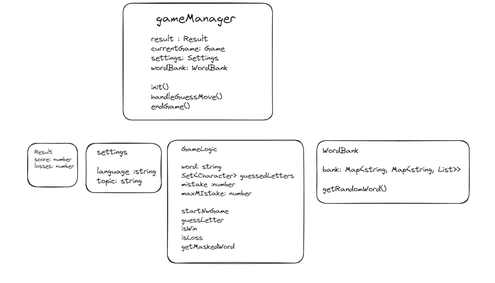
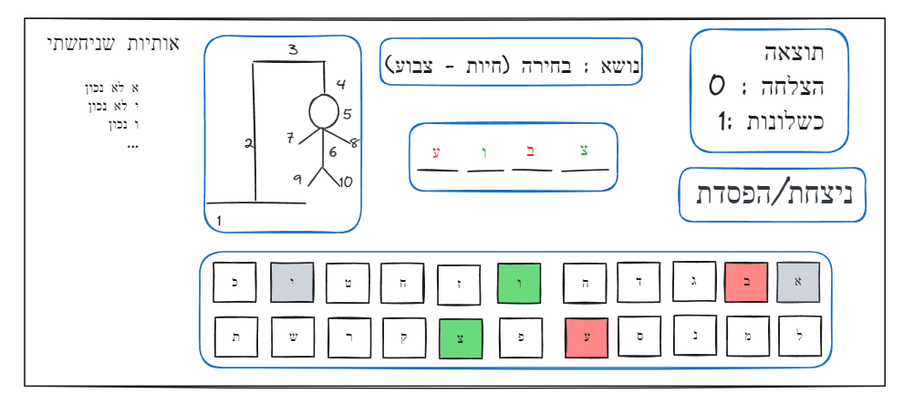

# Hangman Game 🎮

A Hangman game built using HTML, SCSS, JavaScript (ES6+), and jQuery, with a strong focus on MVC architecture and Object-Oriented Programming (OOP) for game logic. Includes unit tests with Jest and a structured plan for game logic and UI.

---
## Features And Technologies Used 🛠️ 🚀
- **Game Mechanics**: Classic Hangman gameplay with dynamic word generation and mistake tracking.
- **Modern JavaScript**: ES6+ syntax with modular structure.
- **SCSS for Styling**: Organized and responsive styles using SCSS.
- **jQuery**: Simplified DOM manipulation.
- **Testing with Jest**: Comprehensive unit tests for game logic.
  
### Architecture:
**MVC** (Model-View-Controller) for clean and maintainable code.
**OOP** (Object-Oriented Programming) to encapsulate game logic.
  
### Development Tools:
- Live development with **live-server**.
- **SCSS** compilation with sass --watch.
- **Prettier** for consistent code formatting.
  
---
## Getting Started 🛠️
Follow these steps to set up and run the project locally:

### Requirements
- Node.js version 20.12+
  
1. Clone the repository:
   ```bash
   git clone https://github.com/username/hangman-game.git
   cd hangman-game

2. Install dependencies:

   ```bash
   npm install
3. Compile SCSS (if needed):
   ```bash
   npm run sass:watch

4. open index.html in your broswer
---

## Game Logic and UI Plan 🧠

### Game Logic:


### UI Plan:



## Testing 🧪
**Jest** is used for testing the game logic.
Mocks were utilized to isolate components and ensure clean separation between system parts.
Generate HTML test reports using **jest-html-reporters**.

Generate HTML test reports using jest-html-reporters.
Run tests with:
   ```bash
   npm test
```
### Test Coverage
The current test coverage for the project is as follows:

